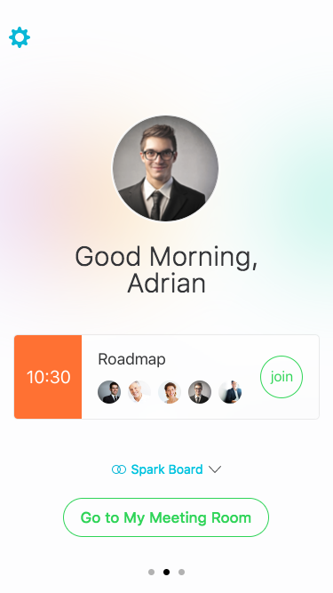

Title: Spark Mobile 2016
Date: 2016-11-27
---

### screen shots

Here is the link.

### Prototype

[https://uxccds.github.io/SparkMobile/v2/page/newapp.html](https://uxccds.github.io/SparkMobile/v2/page/newapp.html)

# Usage

1) Use [Chrome Mobile Simulator](../guide/chrome's-mobile-simulator.html) to open this prototype. Or you can install the prototype as [web app](../guide/install-web-app.html) on your iphone.

2) Swipe to switch panels.

3) In PMR panel, click 'Join' or 'Go to My Meeting Room' to enter a meeting.

3) In Spark panel, click each line to enter the spark room.
 
